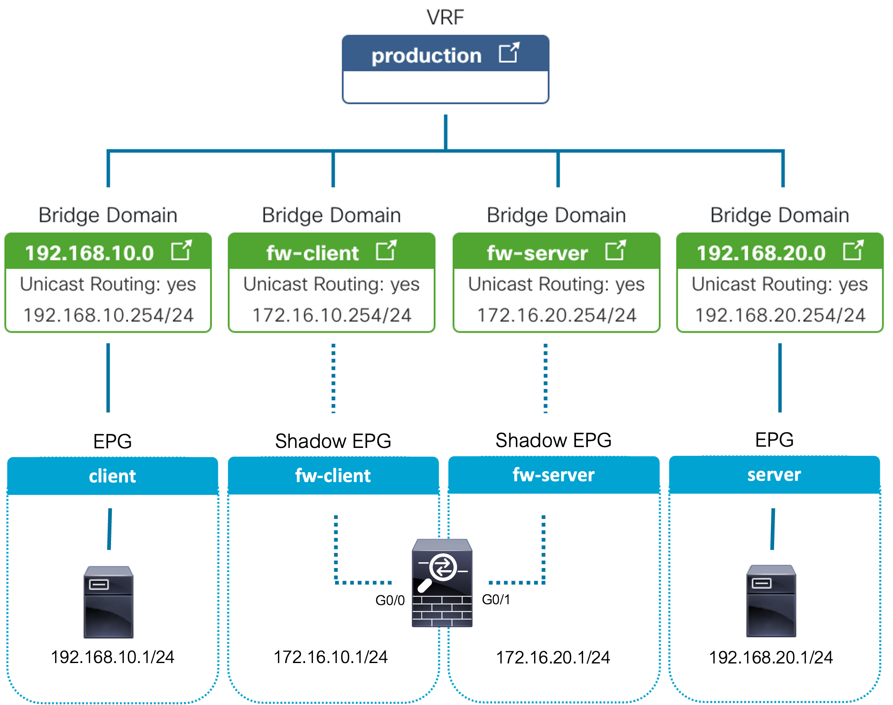

<seotitle>Nexus-as-Code ACI service graph integration example </seotitle>

# Nexus-as-Code ACI Service Graph Integration Example 

This section provides an example of integrating a firewall into an existing ACI fabric. Because Terraform assumes full control of the lifecycle of the resources it creates, this example only contains the tenant module and definitions. That way any existing ACI configuration will not be impacted.

Before deploying this scenario, please follow the Nexus-as-code (NaC) ACI Simple Example to ensure you understand the NaC concepts.

The NaC Simple Example can be found at: https://developer.cisco.com/docs/nexus-as-code/#!simple-example/nexus-as-code-aci-simple-example


<!--- NEED TO UPDATE THIS WITH THE URL --->
<!---The repository used in this example can be found at: https://github.com/netascode/nac-aci-simple-example ---> 


This example assumes you have installed the following prerequisites.

- Terraform 1.3.0 or later.
- Git
- Your preferred text editor / Integrated Development Environment (IDE) (such as VisualStudio Code)

## Example Scenario - Redirect Client to Server Traffic through an ASAv with ACI PBR

This example deploys a new ACI tenant and sets up Policy Based Redirect to steer HTTP traffic from a client EPG through an ASAv to a server EPG. There are multiple options to implement connectivity and the following scenario will configure two service EPGs and two service BDs to which the arms of the firewall will be connected.



While either a physical or a virtual firewall would be supported, in this example scenario it is assumed an ASAv will exist in a VMware vSphere cluster connected to the ACI fabric. Because the example only manages the tenant modules and resources it is assumed the following ACI objects already exist.

- VMware Vcenter VMM domain integration
- Dynamic VLAN Pool from which the VMware port groups receive a VLAN
- AAEP associate the VLAN pool to the VMM domain

> **Note**
> If you are using UCS with Fabric Interconnects the VLANs above must also exist on the Fabric Interconnects. The must also be associated with the respective vNICs assigned to the servers on which the ASAv and client/server VMs are running.

It is assumed that two VMs have already been provisioned, one client and one server. In the creation of this scenario 2 x Ubuntu 20.04 VMs were deployed.


## Getting Started

Start by cloning the repository to your local system:


<!--- NEED TO UPDATE THIS WITH THE URL --->

```cli
git clone https://github.com/netascode/nac-aci-simple-example.git
```

Open the folder in your preferred editor / IDE.

The working area should look like this (the editor shown here is vsCode):

As explained in the Introduction, line 1-28 in the main.tf file contain the required providers, provider settings and merges all *.yaml file definitions located in the data folder. This simple example will only run the tenant module. This module can be found in line 30-37 as shown below:

```hcl
module "tenant" {
  source  = "netascode/nac-tenant/aci"
  version = ">= 0.1.0"

  for_each    = toset([for tenant in lookup(local.model.apic, "tenants", {}) : tenant.name])
  model       = local.model
  tenant_name = each.value
}
```

> **Note**
> If you do not have an ACI environment available you can leverage the DevNet Sandbox environment. For this scenario is it is recommended to use the always-on sandbox. Please refer to the Sandbox section in the menu.

## Step 1: Pre-requisites and ASAv Configuration

As described previously, while either a physical or a virtual firewall would be supported, in this example scenario it is assumed an ASAv will exist in a VMware vSphere cluster connected to the ACI fabric. Because the example only manages the tenant modules and resources it is assumed the following ACI objects already exist.

- VMware Vcenter VMM domain integration
- Dynamic VLAN Pool from which the VMware port groups receive a VLAN
- AAEP associate the VLAN pool to the VMM domain

### ASAv Configuration

The following ASAv `running-configuration` was used in the creation of this scenario. 

> **Warning**
> This ASA configuration is not production ready and has been configured to provide connectivity in this example scenario.

```
cisco-asav-1# show run
: Hardware:   ASAv, 2048 MB RAM, CPU Xeon E5 series 2600 MHz
:
ASA Version 9.16(3)19
!
hostname cisco-asav-1

!
interface GigabitEthernet0/0
 nameif outside
 security-level 100
 ip address 172.16.10.1 255.255.255.0
!
interface GigabitEthernet0/1
 nameif inside
 security-level 100
 ip address 172.16.20.1 255.255.255.0
!
interface Management0/0
 no management-only
 nameif management
 security-level 0
 ip address dhcp
!
same-security-traffic permit inter-interface
!
access-list inside_access extended permit ip any4 any4
access-group inside_access in interface inside
!
access-list outside_access extended permit ip any4 any4
access-group outside_access in interface outside
!
route management 0.0.0.0 0.0.0.0 10.1.100.254 1
route outside 192.168.10.0 255.255.255.0 172.16.10.254 1
route inside 192.168.20.0 255.255.255.0 172.16.20.254 1
!
http server enable
http 10.0.0.0 255.0.0.0 management
```

## Step 2: Tenant Validation

An example tenant definition is provided in `data/tenant_NaC_L4L7_SVC.yaml`. This is where the data (variable definition) is abstracted from the logic (infrastructure declaration).

Navigate to `data/tenant_NaC_L4L7_SVC.yaml` and take note of the structure. This example provisions the following ACI resources

- Tenant
  - NaC_L4L7_SVC
- EPGs
  - client
  - server
- VRFs
  - production
- BDs
  - 192.168.10.0 (GW: 192.168.10.254/24)
  - 192.168.20.0 (GW: 192.168.20.254/24)
  - 172.16.10.0 (GW: 172.16.10.254/24)
  - 172.16.20.0 (GW: 172.16.20.254/24)
- Contracts - Redirected to ASA
  - http permit any any
- Contracts - NOT Redirected
  - icmp permit any any
- L4-L7 Policy-Based Redirect
  - client
  - server
- L4-L7 Device
  - asav
- L4-L7 Service Graph Template
  - asa-routed
- L4-L7 Device Selection Policy
  - asa-routed

> **Note**
> If you already have a tenant named NaC_L4L7_SVC in your ACI infrastructure, you must alter the tenant name in the tenant_NaC_L4L7_SVC.yaml file to avoid overlap. The name of the yaml file itself is arbitrary.

> **Note**
> The following properties from the configuration below should be updated to match your environment
> - vmware_vmm_domain name
> - vcenter_name
> - vm_name
> - l3_destination mac

```yaml
---
apic:
  tenants:
    - name: NaC_L4L7_SVC

      vrfs:
        - name: production

      bridge_domains: 
        - name: 192.168.10.0
          vrf: production
          subnets: 
          - ip: 192.168.10.254/24 
        - name: 192.168.20.0
          vrf: production
          subnets: 
          - ip: 192.168.20.254/24 
        - name: fw-client
          vrf: production
          subnets: 
          - ip: 172.16.10.254/24
        - name: fw-server
          vrf: production
          subnets: 
          - ip: 172.16.20.254/24


      application_profiles:
        - name: segments
          endpoint_groups:
            - name: client
              bridge_domain: 192.168.10.0
              contracts:
                consumers:
                  - web-db
              vmware_vmm_domains:
                - name: my_vmware_vmm # CHANGE THIS
                  delimiter: '|'
                  deployment_immediacy: immediate
                  resolution_immediacy: immediate
            - name: server
              bridge_domain: 192.168.20.0
              contracts:
                providers:
                  - web-db
              vmware_vmm_domains:
                - name: my_vmware_vmm # CHANGE THIS
                  delimiter: '|'
                  deployment_immediacy: immediate
                  resolution_immediacy: immediate

      filters:
        - name: icmp
          entries:
            - name: icmp
              ethertype: ip
              protocol: icmp
        - name: web
          entries:
            - name: http
              ethertype: ip
              protocol: tcp
              destination_from_port: http
              destination_to_port: http

      contracts:
        - name: web-db
          subjects:
            - name: icmp
              filters:
                - filter: icmp
              service_graph: asa-routed
            - name: web
              filters:
                - filter: web
      
      services:
        l4l7_devices:
          - name: asav
            context_aware: single-Context
            type: VIRTUAL
            vmware_vmm_domain: my_vmware_vmm # CHANGE THIS
            function: GoTo
            managed: false
            service_type: FW
            concrete_devices:
              - name: asav
                vcenter_name: my_vcentre # CHANGE THIS
                vm_name: cisco-asav-1 # CHANGE THIS
                interfaces:
                  - name: client
                    vnic_name: Network adapter 2
                  - name: server
                    vnic_name: Network adapter 3
            logical_interfaces:
              - name: client
                concrete_interfaces:
                  - device: asav
                    interface_name: client
              - name: server
                concrete_interfaces:
                  - device: asav
                    interface_name: server
        redirect_policies:
          - name: client
            l3_destinations:
              - ip: 172.16.10.1
                mac: 00:50:56:93:42:5A # CHANGE THIS TO MAC OF ASAV NETWORK ADAPTER 2
          - name: server
            l3_destinations:
              - ip: 172.16.20.1
                mac: 00:50:56:93:A2:51 # CHANGE THIS TO MAC OF ASAV NETWORK ADAPTER 3 
        service_graph_templates:
          - name: asa-routed
            template_type: FW_ROUTED
            redirect: true
            device:
              tenant: NaC_L4L7_SVC
              name: asav
        device_selection_policies:
          - contract: web-db
            service_graph_template: asa-routed
            consumer:
              l3_destination: true
              redirect_policy:
                name: client
              logical_interface: client
              bridge_domain:
                name: fw-client
            provider:
              l3_destination: true
              redirect_policy:
                name: server
              logical_interface: server
              bridge_domain:
                name: fw-server
```

## Step 3: Tenant Deployment

Make sure to update provider block in the `main.tf` file in the root folder with the right credentials and APIC IP address. It is recommended to use signature based authentication. For more information see: [Terraform Provider Documentation](https://developer.cisco.com/docs/nexus-as-code/#!simple-example/step-2-tenant-deployment:~:text=Terraform%20Provider%20Documentation). The reason signature based authentication is preferred is due to APIC rate limiting requests from username and password-based authentication.

```hcl
provider "aci" {
  username = "username"
  password = "password"
  url      = "https://apic.url"
  insecure = true
  retries  = 4
}
```

Initialise Terraform:

```cli
terraform init
```

Run Terraform Apply:

```cli
terraform apply
```

Followed by `yes` to approve.

Upon success you should receive the following output:

```cli
Apply complete! Resources: 79 added, 0 changed, 0 destroyed.
```

Navigate to your APIC and verify that your new tenant `NaC_L4L7_SVC` has been deployed successfully.


